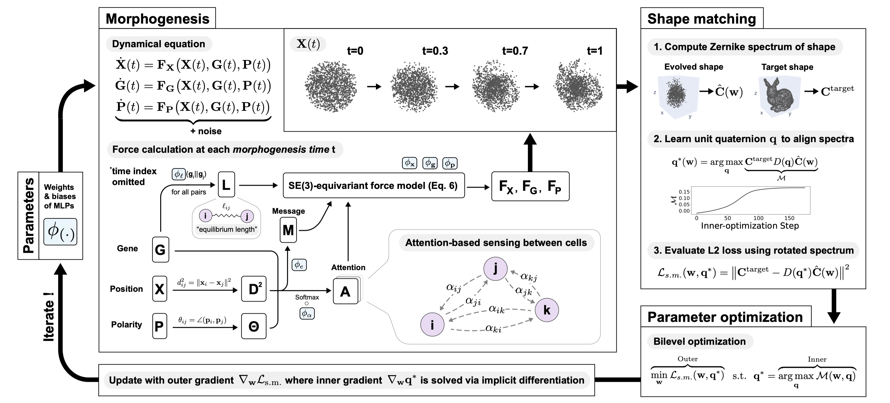

# DiffeoMorph



This repository contains the official implementation for the paper "DiffeoMorph: Learning to Morph 3D Shapes Using
Differentiable Agent-Based Simulations". 

The code consists of two main component:

- SE(3)-equivariant force model 
- Spectral shape-matching loss based on 3D Zernike polynomials

Together, they enable DiffeoMorph to learn morphogenesis control protocols that drive a population of agents to self-organize into specified 3D shapes---while remaining invariant to agent ordering, population size, and global SE(3) transformations.


## Installation

To get up and running, first set up a [Conda](https://conda.io/projects/conda/en/latest/user-guide/install/index.html) enviornment.

```
conda create -n <env_name> python=3.11
conda activate <env_name>
```

Next, clone this repository.
```
git clone https://github.com/hormoz-lab/diffeomorph.git
cd diffeomorph
```

Depending on your computational environment, install DiffeoMorph along with either the CPU or GPU version of Jax:
```
pip install .[cpu]
```
or
```
pip install .[gpu]
```

The GPU option installs the CUDA12 build of Jax, which is the version used to developed this library. If your system requires a different CUDA version, modify this line in `pyproject.toml`:
```
⋮
[project.optional-dependencies]
gpu = ["jax[cuda12]>=0.6.0"]
⋮
```
Update the `jax[cuda12]` specifier to match the CUDA version supported by your environment.


## Reference

If you use DiffeoMorph code or find our paper interesting, please cite:


## License

This code is distributed under the MIT License.